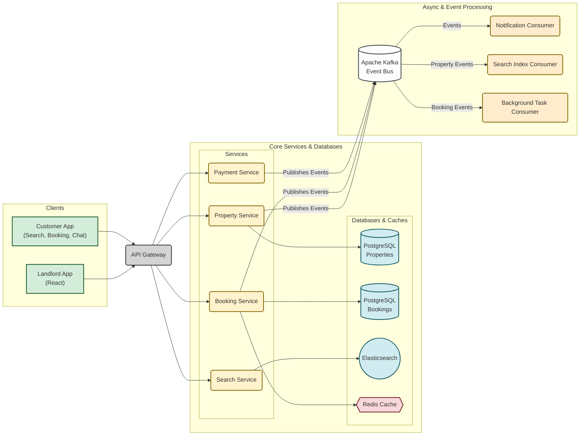
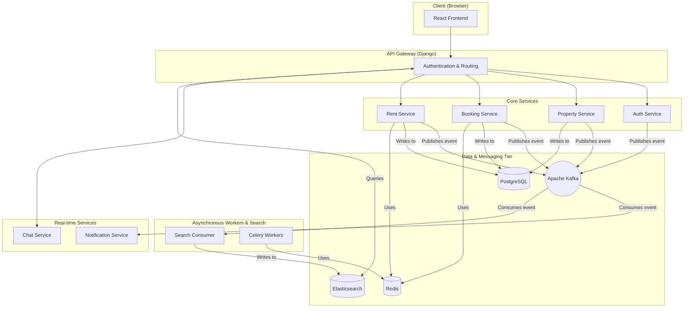

# RentEzy - A Distributed Property Management Platform

<p align="center">
  
  
  
  
  
</p>

**RentEzy** is a comprehensive, cloud-native property management platform engineered from the ground up using a distributed, event-driven microservices architecture. It's designed not just as a web application, but as a resilient, scalable, and maintainable system capable of handling complex, real-world property rental workflows.

---


---


## ► Core Architectural Philosophy

The fundamental goal of RentEzy was to build a system that avoids the pitfalls of a traditional monolith. The architecture is built on three key principles:

1.  **High Cohesion, Loose Coupling:** Each microservice has a single, well-defined responsibility (e.g., `auth_service`, `booking_service`). Services are independent and can be developed, deployed, and scaled without impacting others.
2.  **Asynchronous Communication:** The system uses **Apache Kafka** as its central nervous system. This event-driven approach ensures resilience; if one service fails, others can continue to function, and requests are not lost. It also enables powerful, event-sourced patterns.
3.  **Scalability and Resilience:** The entire platform is containerized with **Docker** and orchestrated with **Kubernetes**, allowing for automated scaling, self-healing, and efficient resource management in a cloud environment.

---
```mermaid
graph LR
    subgraph Clients
        direction TB
        landlord[UI / App for Landlords <br> (Property & Rental Management)]
        tenant[UI / App for Tenants <br> (Search, Booking, Chat, Payments)]
    end

    subgraph Backend Services
        direction TB
        
        subgraph "Synchronous Operations (Direct API Calls)"
            direction TB
            gateway(API Gateway <br> Auth, Routing, Rate Limiting)

            subgraph "Property & Rent Flow"
                prop_service(Property Service) --> prop_db[(PostgreSQL Cluster <br> Properties, Visits)]
            end
            
            subgraph "Search Flow"
                search_service(Search Service) --> es_cluster((Elasticsearch Cluster))
            end

            subgraph "Booking Flow"
                booking_service(Booking Service) --> redis_cache{{Redis Cache <br> Availability}}
                redis_cache --> booking_db[(PostgreSQL Cluster <br> Bookings)]
            end
            
            subgraph "Real-time Flow"
                chat_service(Chat Service <br> WebSockets)
            end

            subgraph "Payment Flow"
                payment_service(Payment Service) --> stripe[/Stripe API/]
            end
        end

    end
    
    subgraph "Asynchronous Event-Driven Processing"
        direction TB
        kafka_bus([Apache Kafka <br> Event Bus])

        subgraph "Event Consumers"
            direction TB
            search_consumer(Search Consumer) --> es_cluster
            notification_service(Notification Service) --> user_comm[Sends Email / Push Notifications]
            celery_workers(Celery Workers <br> Background Tasks) --> redis_broker{{Redis Broker}}
            celery_workers --> booking_db
        end
    end

    %% Client to Gateway
    landlord --> gateway
    tenant --> gateway

    %% Gateway to Services
    gateway -- "/properties" --> prop_service
    gateway -- "/search" --> search_service
    gateway -- "/book" --> booking_service
    gateway -- "/chat" --> chat_service
    gateway -- "/pay" --> payment_service

    %% Services Publishing Events
    prop_service -- Publishes Events (e.g., property_created) --> kafka_bus
    booking_service -- Publishes Events (e.g., booking_confirmed) --> kafka_bus
    payment_service -- Publishes Events (e.g., payment_successful) --> kafka_bus

    %% Kafka Consuming Events
    kafka_bus -- Consumes property_events --> search_consumer
    kafka_bus -- Consumes all_events --> notification_service
    kafka_bus -- Consumes payment_events --> celery_workers
```

## ► System Architecture Diagram
```mermaid
graph LR
    subgraph Clients
        direction TB
        landlord[UI / App for Landlords <br> (Property & Rental Management)]
        tenant[UI / App for Tenants <br> (Search, Booking, Chat, Payments)]
    end

    subgraph Backend Services
        direction TB
        
        subgraph "Synchronous Operations (Direct API Calls)"
            direction TB
            gateway(API Gateway <br> Auth, Routing, Rate Limiting)

            subgraph "Property & Rent Flow"
                prop_service(Property Service) --> prop_db[(PostgreSQL Cluster <br> Properties, Visits)]
            end
            
            subgraph "Search Flow"
                search_service(Search Service) --> es_cluster((Elasticsearch Cluster))
            end

            subgraph "Booking Flow"
                booking_service(Booking Service) --> redis_cache{{Redis Cache <br> Availability}}
                redis_cache --> booking_db[(PostgreSQL Cluster <br> Bookings)]
            end
            
            subgraph "Real-time Flow"
                chat_service(Chat Service <br> WebSockets)
            end

            subgraph "Payment Flow"
                payment_service(Payment Service) --> stripe[/Stripe API/]
            end
        end

    end
    
    subgraph "Asynchronous Event-Driven Processing"
        direction TB
        kafka_bus([Apache Kafka <br> Event Bus])

        subgraph "Event Consumers"
            direction TB
            search_consumer(Search Consumer) --> es_cluster
            notification_service(Notification Service) --> user_comm[Sends Email / Push Notifications]
            celery_workers(Celery Workers <br> Background Tasks) --> redis_broker{{Redis Broker}}
            celery_workers --> booking_db
        end
    end

    %% Client to Gateway
    landlord --> gateway
    tenant --> gateway

    %% Gateway to Services
    gateway -- "/properties" --> prop_service
    gateway -- "/search" --> search_service
    gateway -- "/book" --> booking_service
    gateway -- "/chat" --> chat_service
    gateway -- "/pay" --> payment_service

    %% Services Publishing Events
    prop_service -- Publishes Events (e.g., property_created) --> kafka_bus
    booking_service -- Publishes Events (e.g., booking_confirmed) --> kafka_bus
    payment_service -- Publishes Events (e.g., payment_successful) --> kafka_bus

    %% Kafka Consuming Events
    kafka_bus -- Consumes property_events --> search_consumer
    kafka_bus -- Consumes all_events --> notification_service
    kafka_bus -- Consumes payment_events --> celery_workers
```

This diagram illustrates the flow of communication between services through the API Gateway and the central Kafka message bus.



---

## ► Technical Deep Dive & Key Features

<details>
  <summary><strong>API Gateway & Service Discovery</strong></summary>
  
  An API Gateway (built with Django) acts as the single entry point for all client requests. It is responsible for:
  - **Authentication:** Validating JWTs for secure access.
  - **Request Routing:** Directing incoming requests to the appropriate downstream service.
  - **Rate Limiting & Caching:** Protecting the system from abuse and improving performance.
  This pattern simplifies the client-side implementation and provides a centralized point for cross-cutting concerns.
</details>

<details>
  <summary><strong>Event-Driven Core with Apache Kafka</strong></summary>
  
  Services communicate asynchronously by producing and consuming events on Kafka topics. This decouples services and creates a highly resilient system.
  - **Example Flow:** When a new property is listed, the `property_service` publishes a `property_created` event to a Kafka topic.
  - The `notification_service` consumes this event to alert relevant users.
  - The `search_consumer` consumes this event to update the Elasticsearch index.
  This ensures that even if the notification service is down, the search index will still be updated, and vice-versa.
</details>

<details>
  <summary><strong>High-Performance Search with Elasticsearch (CQRS Pattern)</strong></summary>
  
  To avoid slow, complex SQL queries on the primary database, RentEzy implements a Command Query Responsibility Segregation (CQRS) pattern for search.
  - **Commands (Writes):** All data modifications (creating/updating properties) are handled by the core services and written to the primary **PostgreSQL** database.
  - **Queries (Reads):** A dedicated `search_consumer` listens for data change events from Kafka and updates a denormalized **Elasticsearch** index. All search queries are then routed through the API Gateway directly to Elasticsearch, providing a fast, responsive, and feature-rich search experience (e.g., full-text search, filtering, geo-spatial queries).
</details>

<details>
  <summary><strong>Concurrency-Safe Bookings & Payments</strong></summary>
  
  - **Race Condition Prevention:** The `booking_service` uses database-level transactional locking (`SELECT FOR UPDATE`) to prevent race conditions where two users might try to book the same property at the exact same time.
  - **Automated Payments & Scheduling:** **Celery** and **Redis** are used to handle background tasks. **Celery Beat** schedules recurring monthly rent payments, late fee calculations, and payment reminders. If a payment fails, a Celery worker automatically handles the room release logic.
</sturdy>

<details>
  <summary><strong>Real-time Communication with WebSockets</strong></summary>
  
  **Django Channels** and WebSockets power the real-time features:
  - **Live Chat:** A dedicated `chat_service` manages WebSocket connections for real-time messaging between users.
  - **Event-Driven Notifications:** The `notification_service` pushes real-time alerts to clients when relevant events (e.g., new message, booking confirmed) occur anywhere in the system.
</details>

---

## ► Deployment & Infrastructure

The entire platform is designed for cloud-native deployment.
- **Containerization:** All 10+ services are containerized using **Docker**.
- **Orchestration:** **Kubernetes** (on **AWS EKS**) is used to manage and orchestrate the containers, providing automated scaling, self-healing, and zero-downtime deployments.
- **Persistent Storage:** **AWS EFS** (Elastic File System) is used as the persistent storage solution for services that require a shared file system, managed via the EFS CSI driver for Kubernetes.
- **CI/CD:** (Describe your CI/CD pipeline here if you have one, e.g., "GitHub Actions are used to automate testing and container image builds.")

---

## ► How to Run Locally

To get the full system running locally, you will need Docker and Docker Compose installed.

```bash
# 1. Clone the repository
git clone [https://github.com/your-username/rentezy.git](https://github.com/your-username/rentezy.git)
cd rentezy

# 2. Set up environment variables
# (Create a .env file based on the provided .env.example)
cp .env.example .env

# 3. Build and run the services
docker-compose up --build
```
This will spin up all the services, databases, and the Kafka message bus, creating a fully functional local environment.

